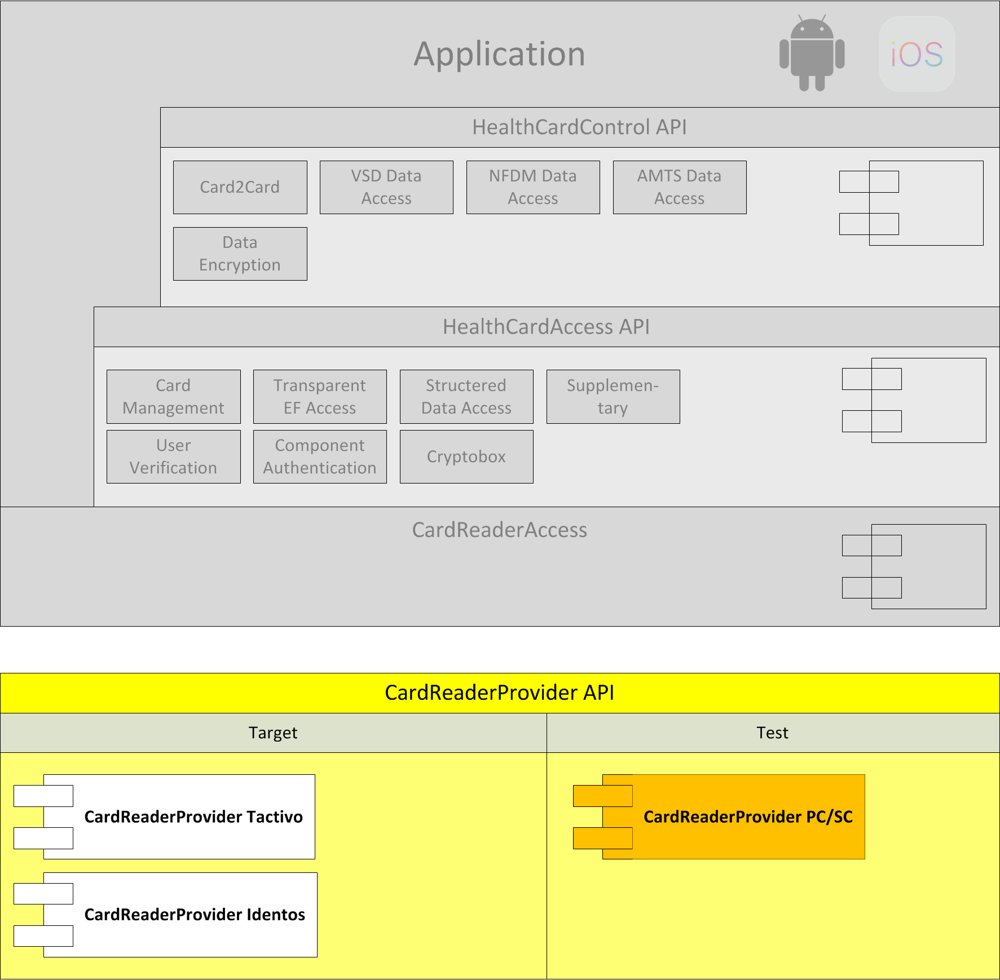
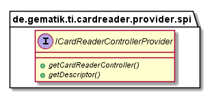
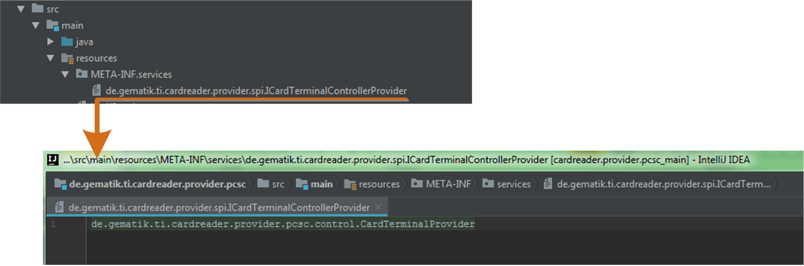
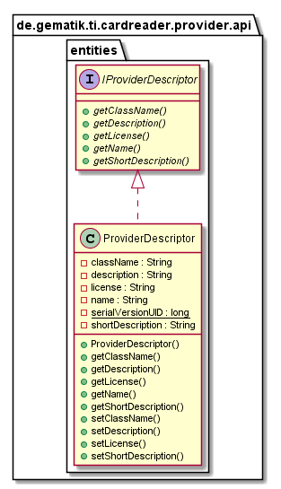
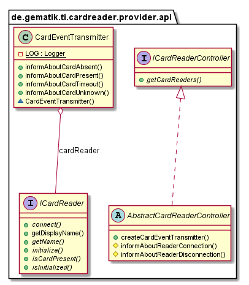
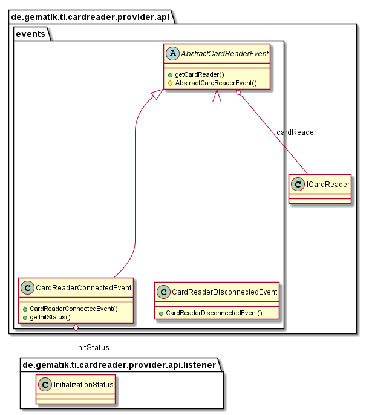
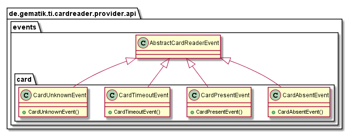
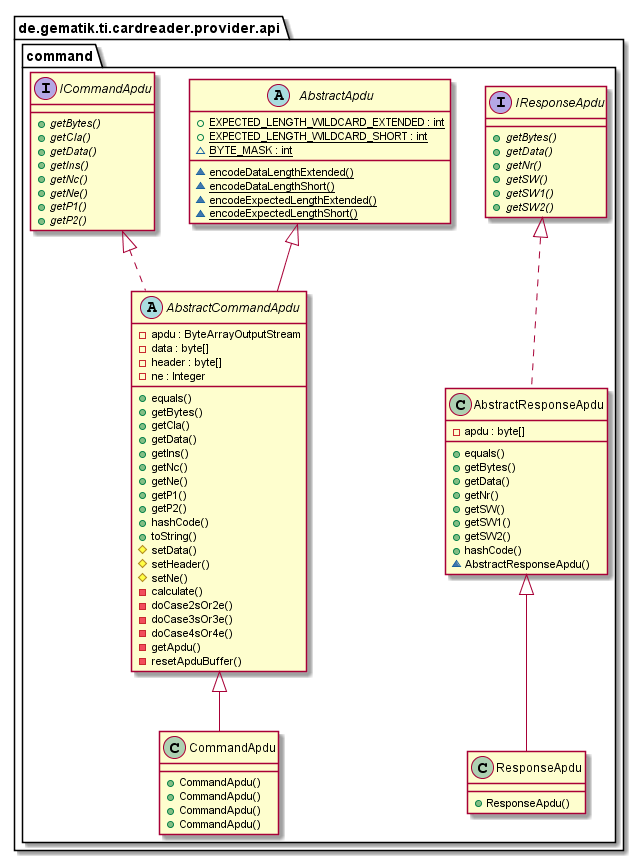

# CardReaderProvider API

## Introduction

The CardReaderProvider API define the general communication interface between application and HealthCardReader to abstract the specific implementation for each hardware card reader.
This part describes the usage of low level CardReaderProvider API in order to use CardReader in your application.

The CardReaderProvider for each specific hardware are implemented as Java Service Provider and would load dynamically by ServiceLoader implemented in CardReaderAccess.

## API Documentation

Generated API docs are available at <https://gematik.github.io/ref-CardReaderProvider-Api>.

## License

Licensed under the [Apache License, Version 2.0](https://www.apache.org/licenses/LICENSE-2.0).

## Overview

This library provides a general (Java SPI) API for abstracting card reader specific implementations.
On mobile devices, each card reader has its own driver and controller implemention provided by card reader manufacturer and thus needs an own provider implementation adapting it to this generic API.
Card reader provider implementations are loaded during runtime by Java’s Service Provider (SPI) mechanism.
The necessary artifacts to implement such a service provider are described in following chapters.

### Service Provider

The entry point for the ServiceLoader is ICardReaderControllerProvider Interface.
This Interface returns the specific [CardReaderController](#crpapi_cardreadercontroller) implementation and a [Descriptor](#_descriptor) class

  

The specific cardreader.provider needs a descriptor within folder `YOUR.PROVIDER\src\main\resources\META-INF\services` with filename
`de.gematik.ti.cardreader.provider.spi.ICardReaderControllerProvider` and the content of the package and class which implements the service provider interface e.g. `de.gematik.ti.cardreader.provider.pcsc.control.CardReaderProvider`

  

### Descriptor

Each implementation of cardreader provider contains an descriptor which contains information about name, licence, provider descriptions, etc.
This class implements the `IProviderDescriptor` interface.
The CardReaderProvider API delivers a default implementation with the class `ProviderDesciptor`.

  

### CardReaderController

The cardreader provider needs an implementation class of `ICardReaderController` interface.
This class handles the card reader for the higher layer application.
The application could request available [CardReader](#_cardreader).
CardReaderProvider API provides a default implementation of `ICardReaderController`
interface as abstract class `AbstractCardReaderController` for ease of use.
The abstract class handles event bus communication and provides methods to inform registered subscribers about card reader changes.

  

### CardReaderConnectionEvents

Each class which should send connection and disconnection events of card reader must register itself as Subscriber at EventBus.
The [CardReaderController](#crpapi_cardreadercontroller)
informs about new card reader and disconnected card reader by sending appropriate events on EventBus.
The information about new card reader contains additional information about `InitializationStatus`.
This information is important for higher layers to decide on the initialisation procedure e.g. request permissions.

  

Each class interested in connection events can register a `CardReaderConnectedEvent` and `CardReaderDisconnectedEvent` receiving method at Eventbus.

**CardReaderConnectedEvent Example.**

    @Subscribe
    public void cardReaderConnected(final CardReaderConnectedEvent connectedEvent) {
        // Do Something
    }

    public void registerOnEventBus() {
        EventBus.getDefault().register(this);
    }

    public void unregisterOnEventBus() {
        EventBus.getDefault().unregister(this);
    }

### CardEvents

Each class which should inform about card events from card reader must register as subscriber at EventBus.
The [CardEventTransmitter](#_cardeventtransmitter)
informs about events on EventBus.

  

Eeach interested class can register a `CardPresentEvent`, `CardAbsentEvent`, …​ receiving method at Eventbus.

**CardEvent Example.**

    public void registerOnEventBus() {
        EventBus.getDefault().register(this);
    }

    @Subscribe
    public void cardConnected(final CardPresentEvent connectedEvent) {
        connectedCards += 1;
        logger.debug("cardConnected, Count: " + connectedCards);
    }

    @Subscribe
    public void cardDisconnected(final CardAbsentEvent disconnectedEvent) {
        connectedCards -= 1;
        logger.debug("cardDisconnected, Count: " + connectedCards);

    }

### CardEventTransmitter

Each class which should inform about card presence events must register itself as subscriber at EventBus.
The [CardReaderController](#crpapi_cardreadercontroller)
creates a CardEventTransmitter for each card reader.
This transmitter informs about new cards, absent cards, timeouts and unknown cards with appropriate events on EventBus.

  

Example how to send card events with `CardEventTransmitter`

**CardEventTransmitter Example.**

    private final ICardReader reader = Mockito.mock(ICardReader.class);

    @Test
    public void sendCardEvent() {
        /* abstractCardReaderController; */ // The Provider specific Controller implementation
        CardEventTransmitter cardEventTransmitter = abstractCardReaderController.createCardEventTransmitter(reader);
        cardEventTransmitter.informAboutCardPresent();
    }

### CardReader

The physical card reader is represented by a class implementing `ICardReader` interface.
This class handles card reader’s initialisation status and card.

  

### Card Commands

The Api provides an general structure of a card command and responses, so called APDU. The detailed implementation of all specific commands healtcards can process is done in a higher layers library.

  

## Getting Started

### Build setup

To use CardReaderProvider API library in a project, you need just to include following dependency:

**Gradle dependency settings to use CardReaderProvider API library.**

    dependencies {
        implementation group: 'de.gematik.ti', name: 'cardreader.provider.api', version: '1.2.1'
    }

**Maven dependency settings to use CardReaderProvider API library.**

    <dependencies>
        <dependency>
            <groupId>de.gematik.ti</groupId>
            <artifactId>cardreader.provider.api</artifactId>
            <version>1.2.1</version>
        </dependency>
    </dependencies>
